```{r packages, message=FALSE, warning=FALSE, include=FALSE}
library('tidyverse')
```


class: inverse, left, top

# Goals
- Present maps and summary charts of a subset of LANDFIRE datasets
- Link to processed spatial data, attribute tables and graphics
- Provide basic interpretive information


 <iframe src="aoi_reference_map.html" width="80%" height="300"></iframe>

Boundary represents proclamation boundary.  Obtained from https://data.fs.usda.gov/geodata/edw/datasets.php?dsetCategory=boundaries.  We used the "Administrative Forest Boundaries" shapefile.

---

class: inverse, left, top

# LANDFIRE

Federal partnership between the USDA Forest Service and US Department of Interior that "provides 20+ national geo-spatial layers (e.g. vegetation, fuel, disturbance, etc.), databases, and ecological models that are available to the public for the US and insular areas." (https://landfire.gov/)


```{r echo=FALSE, message=FALSE, warning=FALSE, fig.align='center', out.width="60%"}
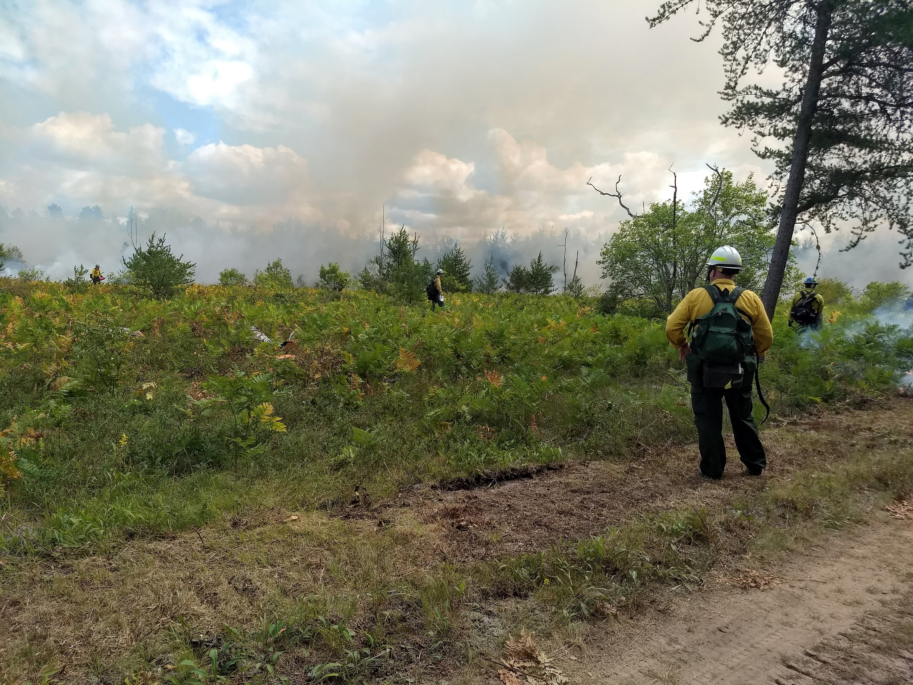
```
<p style="text-align: center;">Prescribed fire on the Hiawatha National Forest, August 22, 2019.</p>

---
class: inverse, left, top

# LANDFIRE #2

Some characteristics of the data:
- Updates data periodically
- Datasets are free and cover all lands for the United States including insular islands
- Developed for large-scale analysis, planning and assessments

This presentation is a sample of the datasets and analysis that can be conducted.

<br>

*The Nature Conservancy* has a cooperative agreement to provide user support, science and to develop appropriate uses of LANDFIRE products.

<br>

```{r echo=FALSE, message=FALSE, warning=FALSE, fig.align='center', out.width="50%"}

```


---
class: inverse, left, top

# Pre-colonization Ecosystems


```{r echo=FALSE, message=FALSE, warning=FALSE, fig.align='center'}
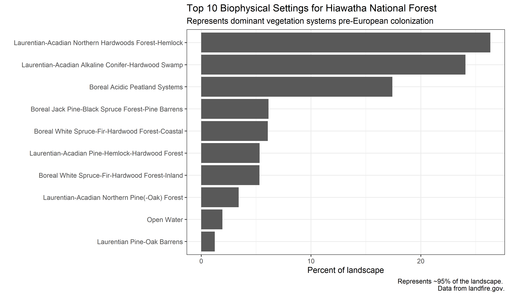
```

---
class: inverse, left, top

# Pre-colonization Ecosystems


```{r echo=FALSE, message=FALSE, warning=FALSE, fig.align='center'}
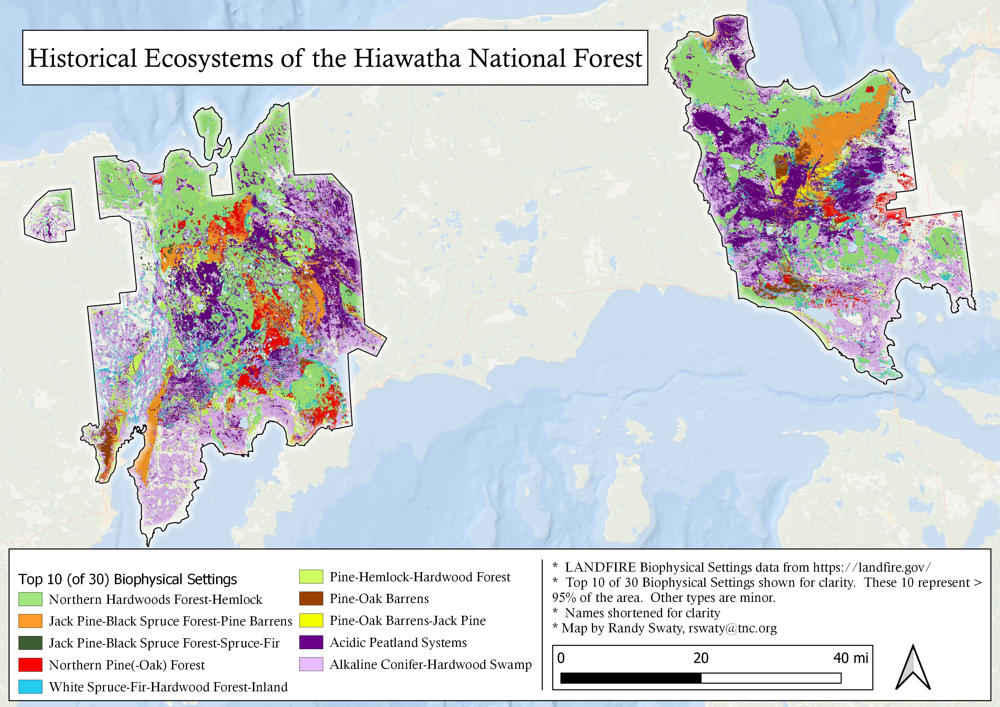
```

---
class: inverse, left, top

# Biophysical Settings notes

- Hiawatha dominated by Northern Hardwoods and wetlands types
- Fire-dependent systems such as Pine barrens and the Pine-Oak forest were dominant as well
- LANDFIRE mapped 30 Biophysical Settings (BpS); many covered less than 1% of the area

Descriptions for all Biophysical Settings can be found by searching by name at https://landfirereview.org/search.php. Each BpS also has an accompanying state-and-transition model.   Please contact landfire@tnc.org, or Randy Swaty (rswaty@tnc.org) for more information. 

---
class: inverse, left, top

# Existing Vegetation Type


```{r echo=FALSE, message=FALSE, warning=FALSE, fig.align='center'}
    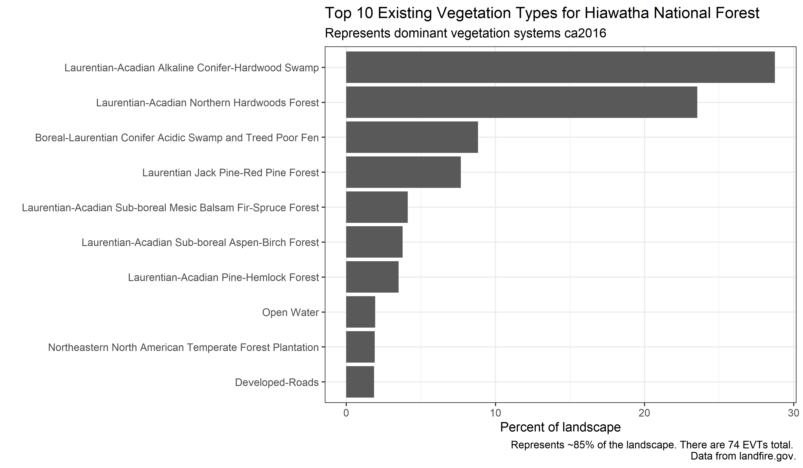
```

---
class: inverse, left, top

# Existing Vegetation Type


```{r echo=FALSE, message=FALSE, warning=FALSE, fig.align='center'}
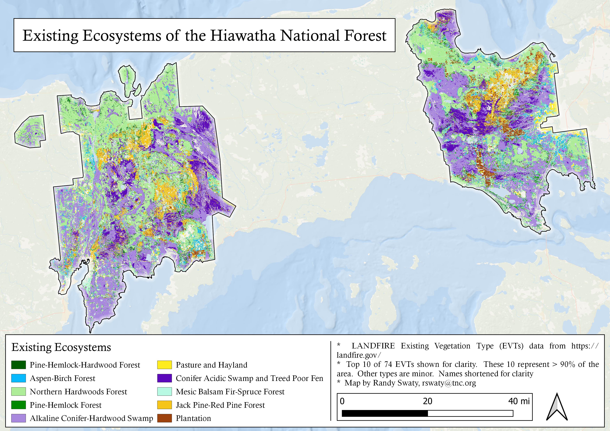
```


---
class: inverse, left, top

# Existing Vegetation Type notes

- Colors were not matched between BpS and the Existing Vegetation Type (EVT) maps.  Be aware when comparing.
- More of the Alkaline Conifer-Hardwood Swamp was mapped in the EVT dataset.  A quick visual inspection of the EVT and BpS map suggested the BpS was more accurate.  More review is needed.
- The legend between the BpS and EVT datasets are different compounding a comparison.  That said the overall patterns are not substantially different.
- For National Forest lands, looking at the succession classes can be more informative than a BpS to EVT comparison as there is typically not much change (e.g., there is not much ag conversion).
 
More information on the EVT dataset available at https://landfire.gov/evt.php.  Descriptions of EVTs available at https://www.landfire.gov/documents/LANDFIRE_Ecological_Systems_Descriptions_CONUS.pdf.  
---
class: inverse, left, top

# Existing Vegetation Cover


```{r echo=FALSE, message=FALSE, warning=FALSE, fig.align='center'}
    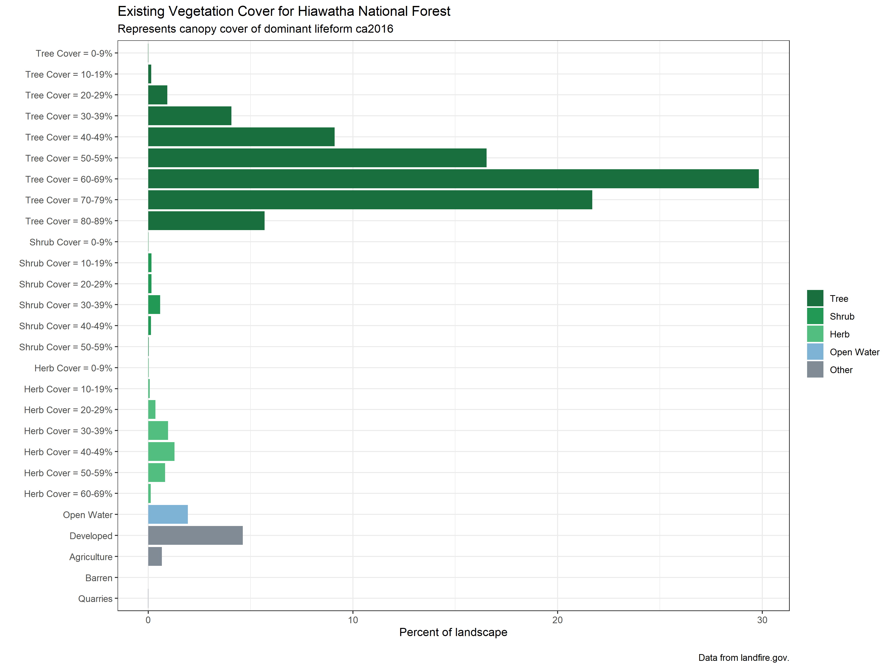
```

---
class: inverse, left, top

# Existing Vegetation Cover


```{r echo=FALSE, message=FALSE, warning=FALSE, fig.align='center'}
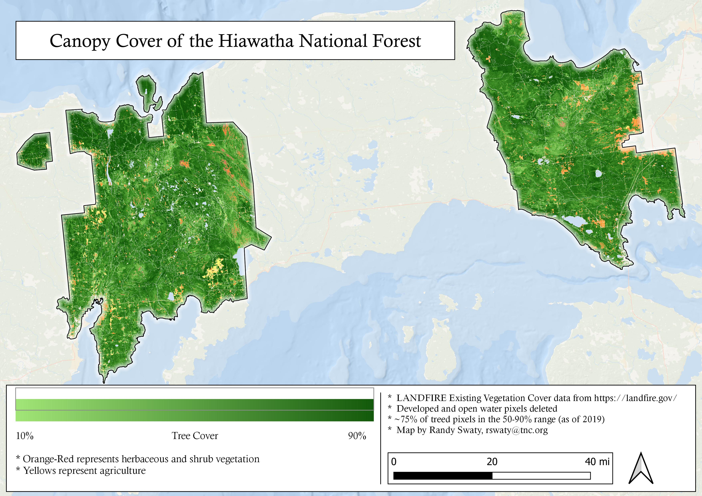
```

---
class: inverse, left, top

# Existing Vegetation Cover notes

-  This data represents the canopy cover of the dominant life form.  As presented here cover is not split out for each BpB or EVT, though that can be done. 
-  Most tree cover is in the 60-60% range.  The ecosystems of the Hiawatha are highly variable in terms of natural disturbance regimes and "expected" cover.  
- Both herbaceous and shrub cover are found on less than 10% of the area.

More information on the Existing Vegetation Cover dataset can be found at https://www.landfire.gov/evc.php

---
class: inverse, left, top

# Existing Vegetation Height


```{r echo=FALSE, message=FALSE, warning=FALSE, fig.align='center'}
    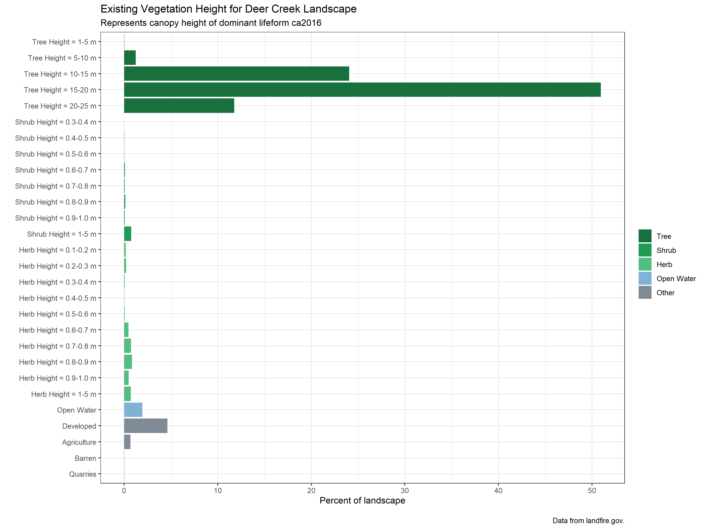
```

---
class: inverse, left, top

# Existing Vegetation Height

```{r echo=FALSE, message=FALSE, warning=FALSE, fig.align='center'}
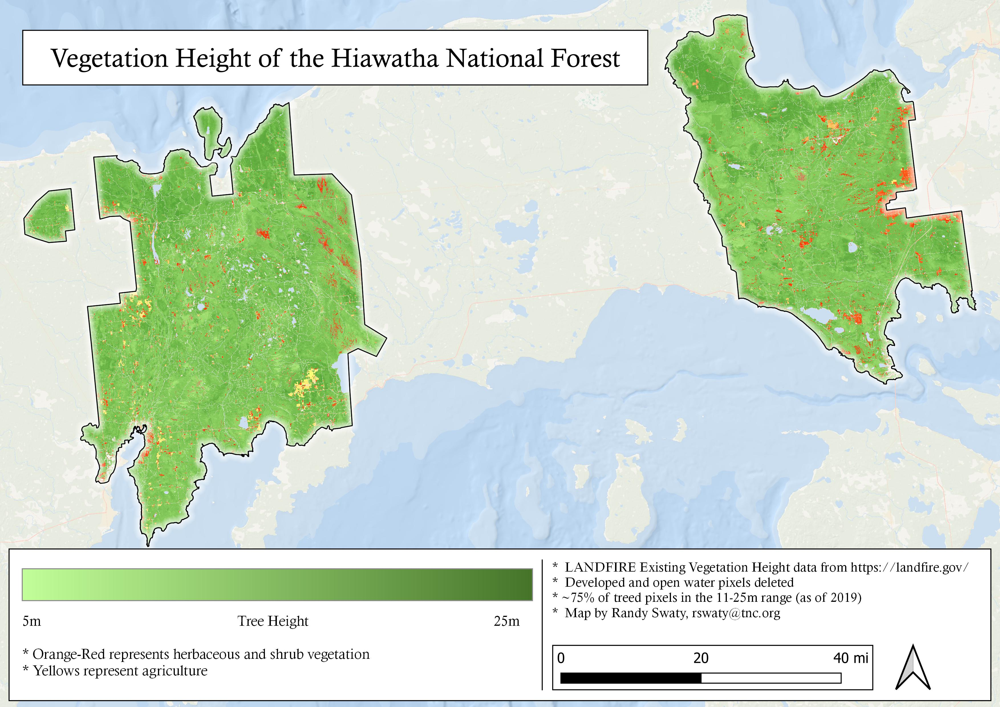
```

---
class: inverse, left, top

# Existing Vegetation Height notes

-  This data represents the canopy height of the dominant life form.  As presented here cover is not split out for each BpB or EVT, though that can be done. 
-  Most tree cover is in the 60-60% range.  The ecosystems of the Hiawatha are highly variable in terms of natural disturbance regimes and "expected" cover.  
- Both herbaceous and shrub cover are found on less than 10% of the area.

More information on the Existing Vegetation Height dataset can be found at https://www.landfire.gov/evh.php

---

class: left, top

# Past vs Present-one way to explore

```{r echo=FALSE, message=FALSE, warning=FALSE, fig.align='center', out.height='80%'}

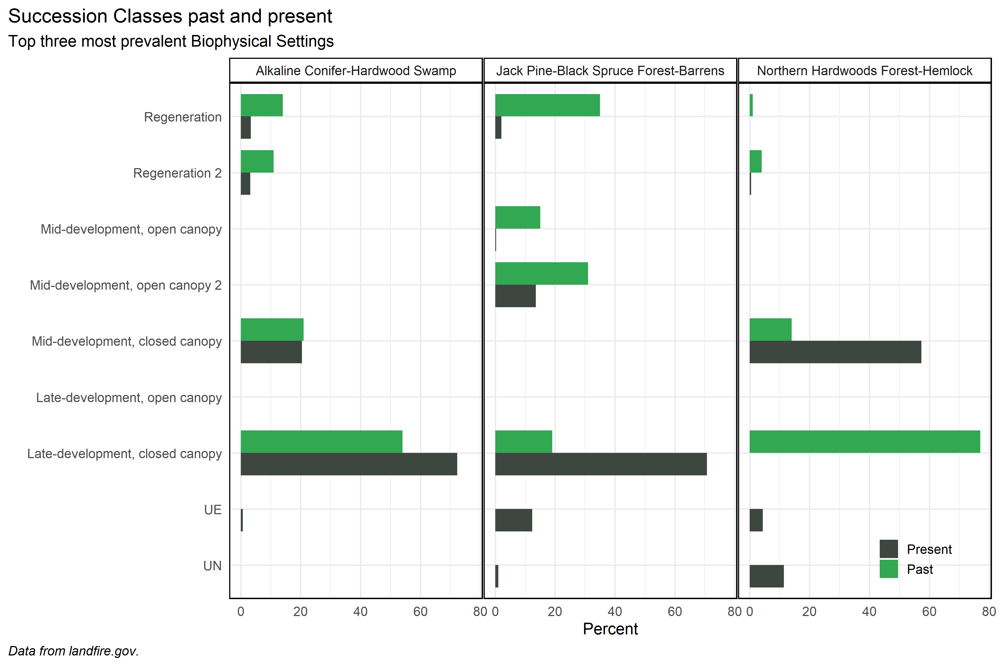

```

---
class: inverse, left, top

# Past vs Present-notes

To compare modeled past vs. current mapped amounts of succession classes we:
- Do a "combine" in ArcGIS Pro of the LANDFIRE BpS and [Succession Classes](https://www.landfire.gov/sclass.php) data to get current amounts
- For this small example subset of BpSs, we searched the [BpS Review](https://landfirereview.org/search.php) website, downloaded the relevant documents then manually entered the values into our dataset that were modeled for the time period just prior to European colonization.  
- In general we find:
    - That there is a slight over-representation of the Late Development and under-representation of the Regeneration classes for the Alkaline Conifer-Hardwood Swamp.
    - The Open and Regeneration classes are substantially under-represented for the Jack Pine-Black Spruce Forest-Barrens.
    - As found in almost all NE states, the Late-Development, closed canopy succession class (as defined by LANDFIRE) is missing from the landscape
    
*While looking at the past is illustrative, LANDFIRE past values do not necessarily represent "Desired Future Conditions".*

---

class: left, top

# Canopy cover by BpS relationships

```{r echo=FALSE, message=FALSE, warning=FALSE, fig.align='center', out.height='80%'}

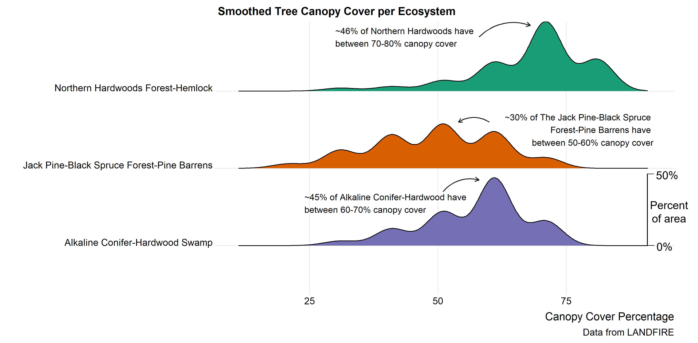

```

One way to look at how canopy cover is distributed across a BpS.  

---
class: inverse, left, top

# Notes on BpS by EVC chart

It is possible to combine datasets to build a deeper understanding.  The "Canopy cover by BpS relationships" chart helps to visualize the distribution of canopy cover across a BpS.

- The chart only explores relationships with 3 BpSs-can be done for all. 
- Comparing with desired future conditions and/or LANDFIRE BpS descriptions may highlight opportunities for management.
- For example, in the BpS description ~80% of this type was modeled to have less than 50% canopy cover, which is not the condition today.

---
class: inverse, left, top

# Next steps, notes and product downloads

The information here is just a beginning.  Much more is possible:

* Calculate amounts of disturbances historically and create maps of historical fire regimes.
* Make additional maps of data sets such as the 40 Fire Behavior Fuel Models
* Compare these datasets to locally developed ones
* Map out other datasets such as those developed by the [Center for Resilient Conservation Science](https://crcs.tnc.org/)

A couple notes:

* We have long known about challenges with mapping and modeling wetlands.  

